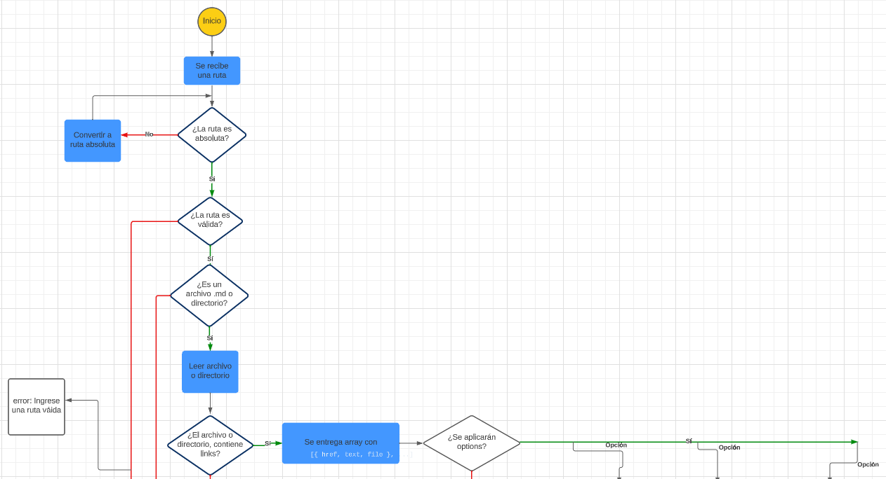
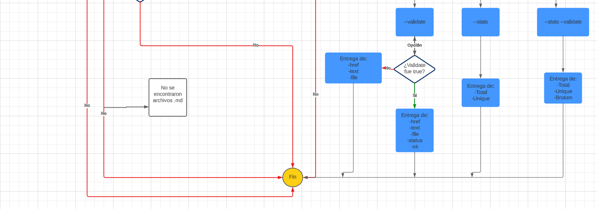

# md-links-karen-m

## Table of contents

* [1. Description](#1-description)
* [2. Installation](#2-installation)
* [3. Usage](#3-usage)
* [4. Results](#4-results)
* [5. Flowchart](#5-flowchart)

***
<p align="center">
  
</p>

## 1. Description

This npm package serves as a versatile tool, offering a Command Line Interface (CLI) that streamlines the validation of Markdown (md) files and the extraction of links within them. Its primary purpose revolves around empowering users to effortlessly parse md files and retrieve essential information concerning the links embedded within these documents.

## 2. Installation

If you wish to set up the "awesome-utils" package, please ensure that you have Node.js and npm correctly installed on your computer. Subsequently, execute the following command within your terminal or command line interface:

```
npm i md-links-karen-m
```

To install it globally use:

```
npm i -g md-links-karen-m
```
## 3. Usage

Once the package is installed, you can use the following command in the command line:

```
md-links-karen-m <path-to-file>
```

Replace <path-to-file> with the path to the file you want to search for links in. Be sure to provide the valid path.

### Options

You can use the following additional options to perform extra validations or obtain link statistics:

* `--validate`: This option validates the links found, verifying if they are active and accessible. It returns information about the status of each link.

```
md-links-karen-m <path-to-file> --validate

```

* `--stats`: This option displays general statistics about the links found in the archive, such as the total link count.

```
md-links-karen-m <path-to-file> --stats

```

* `--validate` `--stats`: You can combine both options to get validations and statistics at the same time.

```
md-links-karen-m <path-to-file> --validate --stats

md-links-karen-m <path-to-file> --stats --validate
```


## 4. Results

You will be able to retrieve the links found in Markdown files after providing a valid path, either for an .md file or a directory. You can then obtain the status or statistics about the discovered links.

## 5. Flowchart



